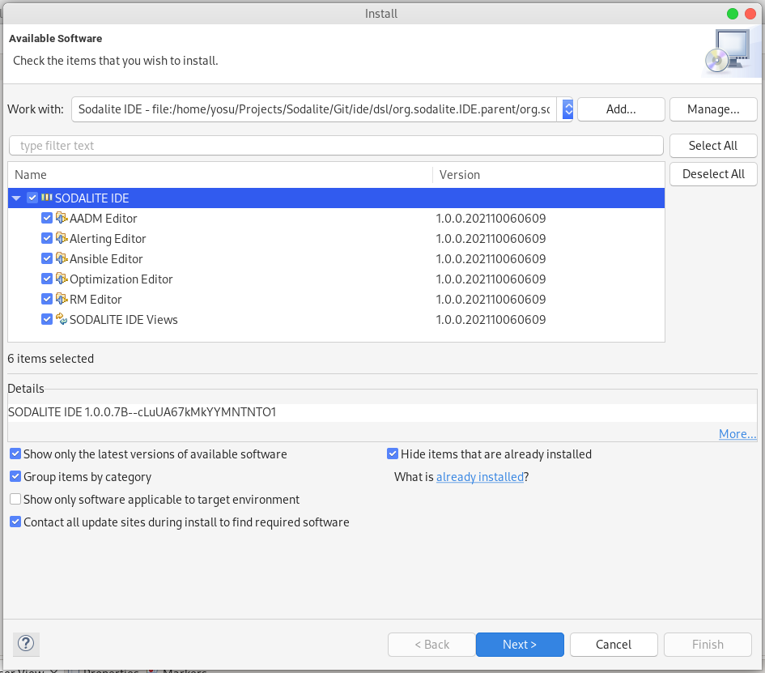

#  Sodalite project: IDE

This repository contains the Sodalite IDE (based on Eclipse).

## Repository structure

- dsl: This folder contains the Eclipse plugins of the Sodalite IDE: DSL Editor for AADM and Resource Models (RMs)
- PoCs: This folder contains some PoCs developed to test XText technologies and model Tosca metamodels
- Docker: image descriptor and scripts to build and pre-configure an IDE container
- scripts: scripts to publish the IDE during the dev-ops pipeline

## Requirements
- Java SDK 11 or above (tested with JDK 16):
Install the Java JDK 16 from [Oracle Downloads](https://www.oracle.com/java/technologies/downloads/#java16)
- Eclipse Modeling Tools:
Install the Eclipse Modeling Tools instance from [Eclipse Downloads](https://www.eclipse.org/downloads/)
Note: SODALITE IDE has been tested in the version 2021-09 R (4.21.0) of the Eclipse Modeling Tools, which can be downloaded from [here](https://www.eclipse.org/downloads/packages/release/2021-09/r/eclipse-modeling-tools)

## IDE Installation from the Sodalite IDE update site
### Add Software sites for Sodalite IDE and dependencies
1. In Eclipse, select the menu option: *Help/Install New Software...*. Click on the *Add* button. In the dialog, give the name *"SODALITE IDE"* and the following update site location: https://sodalite-eu.github.io/ide/. 
Then, click on *Add* button.  

2. Following the same procedure as before add the following external software repositories to your list of software sites:
Name: Sirius-XText integration, Location: https://altran-mde.github.io/xtext-sirius-integration.io/p2/
3. Make sure that in the *Install software* dialog window, in the *Work with* combo box, you select the *SODALITE IDE* entry. In the below panel, mark the *SODALITE IDE* checkbox. Be sure the chekbox *Contact all updates sites during install to find required software* is selected. Click twice the *Next* button. Accept the license, and finish the dialog. When prompted, accept. Restart Eclipse once the SODALITE IDE has been installed.

Note: update site links are not browsable. Do not think these above links are wrong if you try to open them in a browser and you get a empty page or a 404 Page not found error.

## IDE Installation from the Sodalite IDE source code

Follow the following procedure to download the SODALITE IDE, build and install it into your Eclipse installation:

### Build the Sodalite IDE update site from sources
1. Install the following dependencies required to build the IDE:
- Java SDK 11 (Maven build does not work with a more recent JDK): Install the Java JDK 11 from [Oracle Downloads](https://www.oracle.com/java/technologies/downloads/#java11)
- Maven: Install Maven from [Maven Download](https://maven.apache.org/download.cgi)
2. Clone SODALITE IDE repository from GitHub: `git clone https://github.com/SODALITE-EU/ide.git`. This will create a local folder, hereafter referenced as *$IDE_REPO*
3. Open a CLI and go to *$IDE_REPO/dsl/org.sodalite.IDE.parent* folder. Build the SODALITE IDE Eclipse repository (i.e. update site) using Maven, with this command: `mvn clean verify -U`
4. Once complete, open the Eclipse Modeling Tools instance.

### Add Software sites for Sodalite IDE and dependencies

1. In Eclipse, select the menu option: *Help/Install New Software...*. Click on the *Add* button. In the dialog, give the name *"SODALITE IDE"* and click on the *Local* button. Navigate to the path *$IDE_REPO/dsl/org.sodalite.IDE.parent/org.sodalite.IDE.repository/target/repository/*. Then, click on *Add* button. 
2. Following the same procedure as before add the following external software repositories to your list of software sites:
Name: Sirius-XText integration, Location: https://altran-mde.github.io/xtext-sirius-integration.io/p2/
3. In the former dialog, in the *Work with* combo box, select the *SODALITE IDE* entry. In the below panel, mark the *SODALITE IDE* checkbox. Be sure the chekbox *Contact all updates sites during install to find required software* is selected. Click twice the *Next* button. Accept the license, and finish the dialog. When prompted, accept. Restart Eclipse once the SODALITE IDE has been installed.

## IDE Documentation
[IDE tutorial](https://docs.google.com/document/d/1w6wYJbTZvBbt5LD6sXReXbx1uPDjefYFAU5KEv8X_8w/edit?usp=sharing) for users is available

Main contact: Jesús Gorroñogoitia <jesus.gorronogoitia@atos.net>

 
